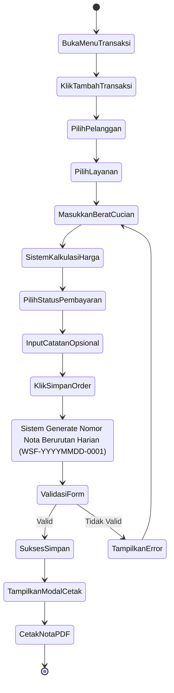
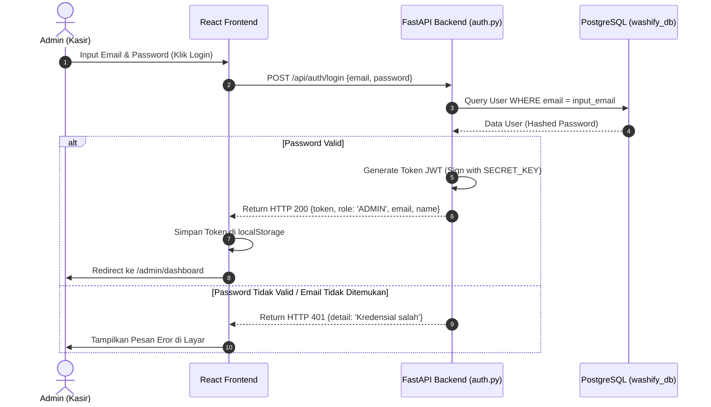
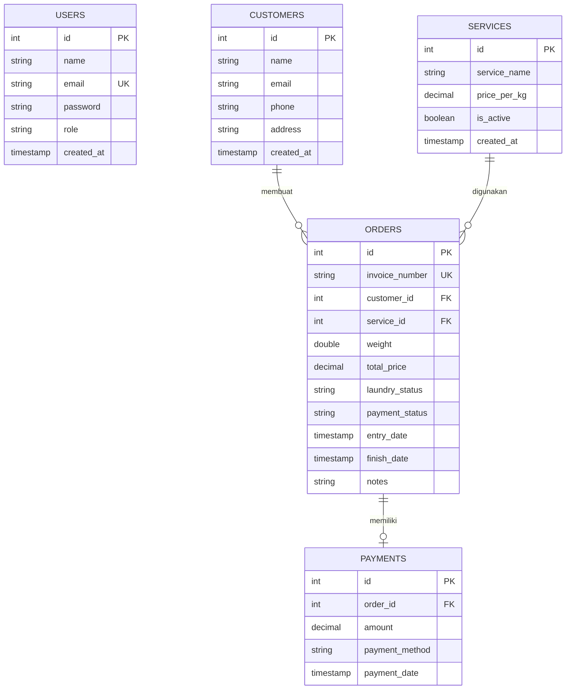
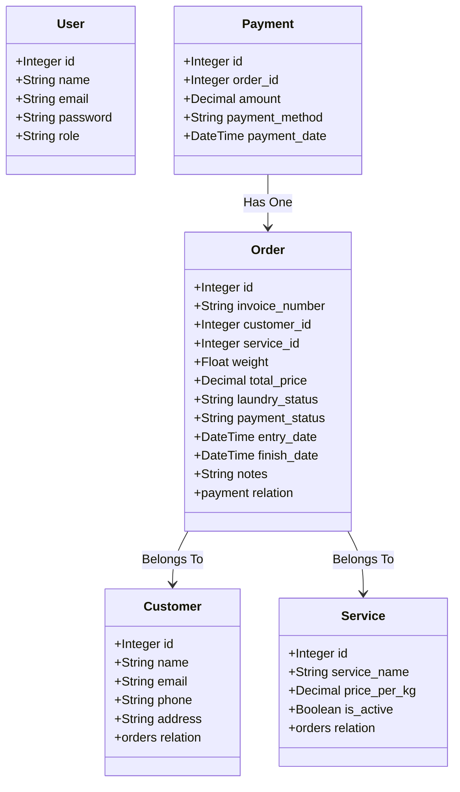

# Phase 2: Desain Sistem & UML Diagrams (Washify)

Dokumen ini mendokumentasikan pemodelan arsitektur perangkat lunak **Washify** menggunakan spesifikasi diagram UML (Unified Modeling Language) berbasis Mermaid.

---

## 1. Use Case Diagram
Menggambarkan interaksi aktor tunggal (**Admin**) terhadap fungsi-fungsi utama sistem Washify.

```mermaid
usecaseDiagram
    actor Admin
    
    Admin --> (Login & Kelola Sesi)
    Admin --> (CRUD Data Pelanggan)
    Admin --> (CRUD Paket Layanan)
    Admin --> (Pencatatan Transaksi & Auto Nota)
    Admin --> (Update Status Cucian & Bayar)
    Admin --> (Cetak Nota dengan QR Code)
    Admin --> (Melihat Laporan Omset Harian)
    Admin --> (Melihat Analisis Prediksi Linear Regression)
```

---

## 2. Activity Diagram (Alur Transaksi Baru)
Menggambarkan alur aktivitas kasir/admin saat membuat pencatatan transaksi laundry baru.



---

## 3. Sequence Diagram (Autentikasi & JWT Authorization)
Menunjukkan interaksi berurutan antara Frontend React, API Gateway FastAPI, Router Auth, dan Database PostgreSQL saat proses login admin.



---

## 4. Entity Relationship Diagram (ERD)
Menggambarkan struktur relasi tabel database PostgreSQL (`washify_db`) pendukung sistem Washify.



---

## 5. Class Diagram (Arsitektur Backend)
Memetakan class Entity SQLAlchemy dan skema validator Pydantic pada sistem backend FastAPI.


